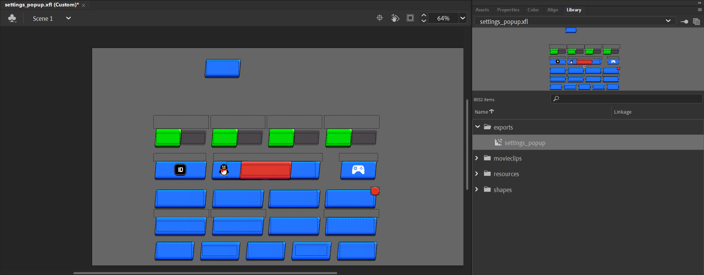

# SupercellAnimateExporter
A tool to export ONE export from [SupercellSWF](https://github.com/sc-workshop/SupercellSWF-Animate) platform to a new .fla (Good for low-end PCs)

> Example Usage: `AnimateExporter.exe ui.sc settings_popup true`

## Requirements
- .NET 8.0

## How to build yourself
The code is really small and is easy to change even for newbies tho this code style I used here isn't the best. Use `dotnet publish` to build the project.

## Known Bugs
You absolutely need to use the "true" flag as a last argument (or not, it should use it as default). It copies all the assets and bitmaps from the original .fla to the new one. Putting "false" there will result in not every asset being copied and the export won't be complete with all required assets. 

__You can copy the export to a new .fla as it will copy the required assets then and you should be fine. Take this as a workaround.__

## Credits
- [Daniil SV](https://github.com/Daniil-SV) - for replying to my stupid (for him) questions lol
